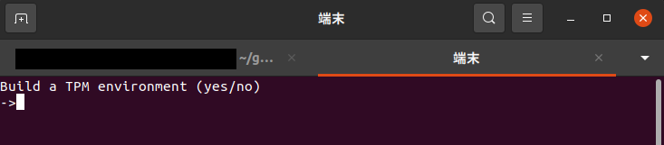

# TPM2.0 環境構築用プログラム


## できること
* TPM2.0の環境構築
  * tpm2-tssとtpm2-toolsを使用して環境構築を行います
  * tpm2-tss: https://github.com/tpm2-software/tpm2-tss
  * tpm2-tools: https://github.com/tpm2-software/tpm2-tools
* TPMを用いた乱数の生成
  * 環境構築後にTPMへの最初のアクセスとしてTPMを用いた乱数生成を行います
  * 使用するコマンドは tpm2_getrandomです
  * 乱数生成以外にTPMへのアクセスは行いません

# 実行環境
* TPMを搭載したPC
* BIOSからTPMが有効化済み
* ローカル環境で動作するUbuntu
  * VMからTPMへのアクセスはできません

# 実行方法

## 環境構築

### 実行ファイルへ移動し実行
```
cd build
./tpm-setup
```

###  "TPM2 Env Setup"を選択


### 開いた端末でyesを入力


---
## TPMへアクセス確認

### TPM2 Get Randomを選択
* 取得する乱数のバイト数を選択可能
* 上限は32Byte

